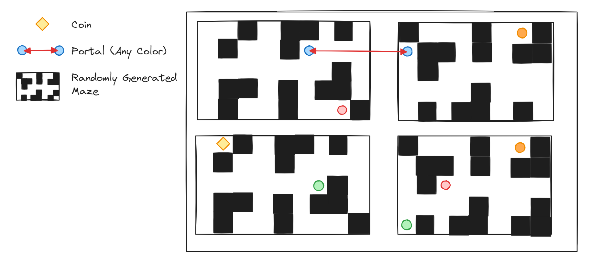
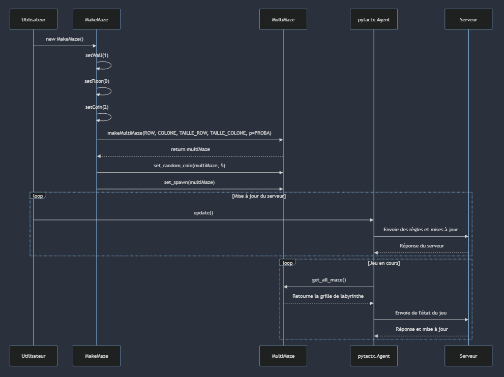

#  A-Mazing-Tower

## Description:

Bienvenue dans "A Mazing Tower" ! Un jeu de labyrinthe passionnant où vous devez explorer quatre salles labyrinthiques
et collecter des pièces pour atteindre la victoire.

## 🎯 Contexte & Cahier des Charges

Développé dans le cadre d'une formation pour permettre une montée en compétence en Python, ce jeu vise à apprendre les
bonnes pratiques de programmation de manière ludique.

### Backlog:

| id | description                                                                        | priorité |
|:--:|------------------------------------------------------------------------------------|:--------:|
| 1  | En tant qu'utilisateur, je peux voir la carte                                      |    1     |
| 2  | En tant qu'utilisateur, je peux voir mes points                                    |    1     |
| 3  | En tant qu'utilisateur, je peux me déplacer dans la salle où je suis               |    2     |
| 4  | En tant qu'utilisateur, je peux ramasser des pièces                                |    2     |
| 5  | En tant qu'utilisateur, je peux me déplacer entre les salles avec un "téléporteur" |    3     |
| 6  | En tant qu'utilisateur, je peux ramasser des bonus/malus                           |    4     |

## 🎲 Règles du jeu

- **Maquette :**

- **Déroulé d'une partie :**
    - Les joueurs apparaissent dans un des 4 labyrinthes.
    - Des pièces apparaissent aléatoirement dans les 4 labyrinthes.
    - Les joueurs peuvent se déplacer dans les labyrinthes en utilisant des téléporteurs.
    - Dès qu'il n'y a plus de pièces, les labyrinthes sont réinitialisés.

- **Conditions de Victoire :** Être le joueur ayant ramassé le plus de pièces.

## 🎮 Use Cases

### Pour l'Administrateur

Un administrateur peut/doit :
- Remplir le fichier [.env](.env) avec les paramètres de l'arène et de l'arbitre
- Exécuter le fichier [mapMaker.py](src/server/mapMaker.py) comme décrit dans la section [Installation](#user-content-️-installation)

### Pour le Joueur

Pour les informations sur le joueur, veuillez vous référer au [README](/src/api/README.md) de l'API.

## 📞 Diagramme de Séquence

Voici le diagrame de séquence de notre jeu (côté serveur) :

## ✅ Pré-requis

### Pour l'Administrateur

- Python 3.12 ou plus 🐍
- une arène dans Pytactx

### Pour les Apprenants

Pour les prérequis des apprenants, veuillez vous référer au [README](/src/api/README.md) de l'API.

## ⚙️ Installation

- `pip install paho-mqtt pillow requests python-decouple`
- `git clone https://github.com/LighTend3r/A-Mazing-Tower.git`
- `cd scr/server`
- `python mapMaker.py`

Et voila 👍

## 🧪 Tests

### Test fonctionnel

Vous pouvez lancer le BOT de test en allant dans le répertoire : /tests/api/
et en exécutant le fichier **AgentExemple.py**

## 🛣️ Roadmap
[Trello](https://trello.com/b/R8wMPjQq/pytactx)
Il reste le bonus et malus à implémenter, pour plus de mécanique et de complexité.

## 🧑‍💻 AuteurS

- Antoine CLERICE
- Thomas FEDORAWIEZ
- Léo HARNOIS
- Pierre TOITOT

- L'équipe ***Jusdeliens*** 🔥🔥🔥

## ⚖️ Licence

Ce projet est sous licence [MIT License](https://opensource.org/license/mit/). Consultez le
fichier [`LICENSE.md`](LICENSE.md) pour plus d'informations.
