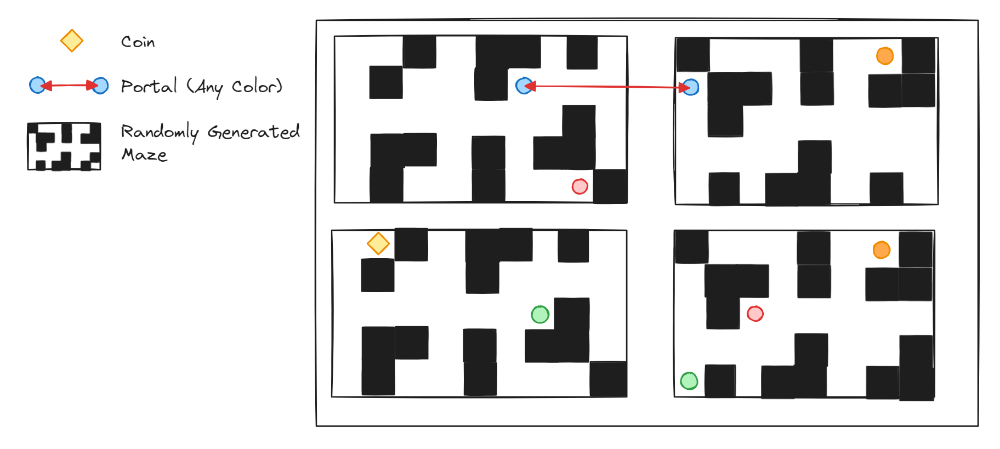

#  A-Mazing-Tower

## Description:

Bienvenue dans "A Mazing Tower" ! Un jeu de labyrinthe passionnant où vous devez explorer quatre salles labyrinthiques
et collecter des pièces pour atteindre la victoire.

## 🎲 Règles du jeu

- **Maquette :**



- **Déroulé d'une partie :**
    - Les joueurs apparaissent dans un des 4 labyrinthes.
    - Des pièces apparaissent aléatoirement dans les 4 labyrinthes.
    - Les joueurs peuvent se déplacer dans les labyrinthes en utilisant des téléporteurs.
    - Dès qu'il n'y a plus de pièces, les labyrinthes sont réinitialisés.

- **Conditions de Victoire :** Être le joueur ayant ramassé le plus de pièces.

## 🎮 Use cases

#### Voici la liste des méthodes de la classe Runner :

```python
def get_coordinates() -> tuple[int, int]:
  """
  Renvoie les coordonnées du runner (x, y).
  """


def get_map() -> tuple[tuple[int]]:
  """
  Renvoie la carte de l'arène.
  """


def get_current_tile() -> int:
  """
  Renvoie la valeur de la case sur laquelle est l'agent.
  0 → Chemin
  1 → Mur
  2 → Pièce
  Above → Portail
  """


def update() -> None:
  """
  Récupérer les dernières valeurs des données du joueur sur le serveur.
  Et envoyer les requêtes tamponnées en une seule fois pour limiter la bande passante.
  À appeler dans la boucle principale au moins toutes les 10 msecs.
  """


def move_up() -> bool:
  """
  Essaie de se déplacer vers le haut.
  """


def move_down() -> bool:
  """
  Essaie de se déplacer vers le bas.
  """


def move_left() -> bool:
  """
  Essaie de se déplacer vers la gauche.
  """


def move_right() -> bool:
  """
  Essaie de se déplacer vers la droite.
  """


def take_coin() -> bool:
  """
  Essaie de prendre une pièce si on est sur un case de type 'Pièce'.
  """


def take_portal() -> bool:
  """
  Essaie de prendre un portail si on est sur une case de type 'Portail'.
  """

def reset_dir(self):
    """
    Remet la direction de l'agent à défaut.
    """
```

## ✅ Pré-requis

- Python 3.12 ou plus 🐍
- une arène Pytactx sur laquelle **A Mazing Tower** est lancé
- un cerveau 🧠

## ⚙️ Installation

- `pip install paho-mqtt pillow requests python-decouple`
- `git clone https://github.com/LighTend3r/A-Mazing-Tower.git`
- `cd src/api`
- ***`faire un bot`*** 🤖
- `python main.py`

## 🧑‍💻 Auteurs

- Antoine CLERICE
- Thomas FEDORAWIEZ
- Léo HARNOIS
- Pierre TOITOT

- L'équipe ***Jusdeliens*** 🔥🔥🔥

## ⚖️ License

Ce projet est sous licence [MIT License](https://opensource.org/license/mit/). Consultez le
fichier [`LICENSE.md`](../../LICENSE.md) pour plus d'informations.
